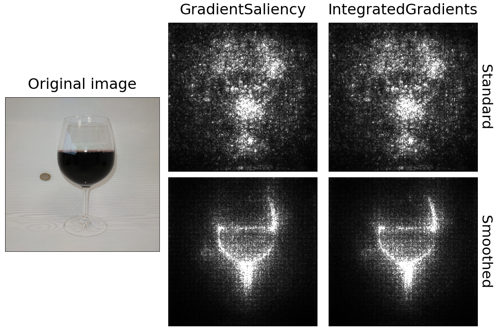
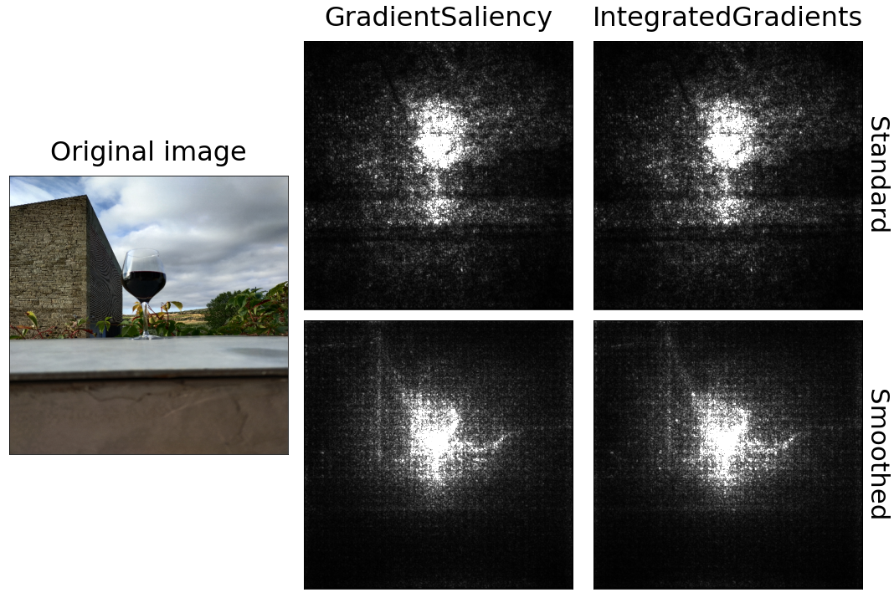

Liquid volume estimation from RGB images
=========================================

**Author:** [Miriam Cobo](https://github.com/Miriammmc) (CSIC)

**Description:** This work provides a tool to train and evaluate an image regression model. The code is adapted to liquid volume estimation of glass containers as part of the [BrainGut-WineUp](https://alimenta365.csic.es/) project.

**Acknowledgements:** Miriam Cobo acknowledges support from Consejo Superior de Investigaciones Científicas (CSIC) and Instituto de Física de Cantabria (IFCA) via the “Proyecto Branyas” project.

This work is an adaptation to regression tasks of the original image classification [DEEP Hybrid-DataCloud](https://deep-hybrid-datacloud.eu/) project that has
received funding from the European Union’s Horizon 2020 research and innovation programme under grant agreement No 777435. It was developed by [Ignacio Heredia](https://github.com/IgnacioHeredia) (CSIC). You can find more information about it in the [DEEP Marketplace](https://marketplace.deep-hybrid-datacloud.eu/modules/deep-oc-image-classification-tf.html).

**Table of contents**
1. [Notebooks content](#notebooks-content)
2. [Description of the adaptations from the original code](#description-of-the-adaptations-from-the-original-code)
3. [Acknowledgements](#acknowledgments)

## Notebooks content

You can have more info on how to interact directly with the module by examining the 
``./notebooks`` folder:

* [glasses examples notebook](./notebooks/0.0-Glasses_examples.ipynb):
  Visualize examples of the liquid containers used to train the classifier.

* [sets preparation notebook](./notebooks/1.0-Sets_preparation.ipynb):
  Split the data into training, validation and test sets.
  
* [model training notebook](./notebooks/2.0-Model_training.ipynb):
  Visualize training and validation model statistics.

* [computing predictions notebook](./notebooks/3.0-Computing_predictions.ipynb):
  Test the classifier on multiple images.

* [predictions statistics notebook](./notebooks/3.1-Prediction_statistics.ipynb):
  Make and store the predictions of the `test.txt` file (if you provided one). Once you have done that you can visualize
  the statistics of the predictions like popular metrics (Mean Abosulte Error, Root Mean Squared Error and Coefficient of Determination) and visualize violin       plots of the predictions.

* [saliency maps notebook](./notebooks/3.2-Saliency_maps.ipynb):
  Visualize the saliency maps of the predicted images, which show what were the most relevant pixels in order to make the prediction.

  
   

## Description of the adaptations from the original code

The main changes of the original code were done in order to adapt the code from classification to regression tasks:

* [configuration](https://github.com/Miriammmc/image-classification-tf/blob/0e229c2d998f85eefbda026cb9f23f80ca1f6dcb/etc/config-r.yaml#L51-L58)

* [config python script](https://github.com/Miriammmc/image-classification-tf/blob/0e229c2d998f85eefbda026cb9f23f80ca1f6dcb/imgclas/config.py#L17)

* [data utils python script](https://github.com/Miriammmc/image-classification-tf/blob/01eeceb1b5b92b71a2a285e898aa4c8f798205fd/imgclas/data_utils.py#L75-L78)

* [model utils python script](https://github.com/Miriammmc/image-classification-tf/blob/01eeceb1b5b92b71a2a285e898aa4c8f798205fd/imgclas/model_utils.py#L52)

* [plot utils script](https://github.com/Miriammmc/image-classification-tf/blob/01eeceb1b5b92b71a2a285e898aa4c8f798205fd/imgclas/plot_utils.py#L55-L57)

* [test utils python script](https://github.com/Miriammmc/image-classification-tf/blob/01eeceb1b5b92b71a2a285e898aa4c8f798205fd/imgclas/test_utils.py#L71-L85)

* [train runfile python script](https://github.com/Miriammmc/image-classification-tf/blob/01eeceb1b5b92b71a2a285e898aa4c8f798205fd/imgclas/train_runfile.py#L85-L104)

## Acknowledgements

If you consider this project to be useful, please consider citing the *paper DOI*.
